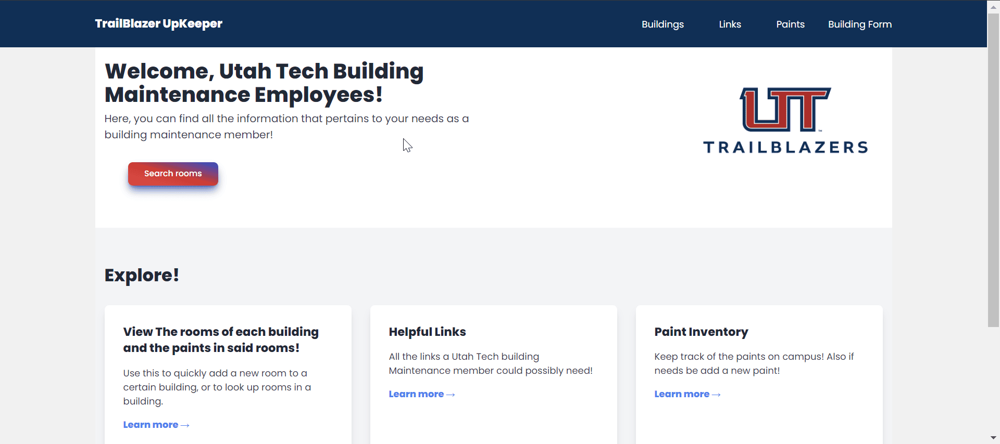
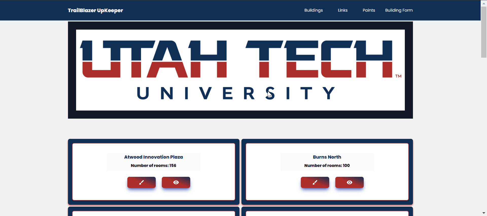
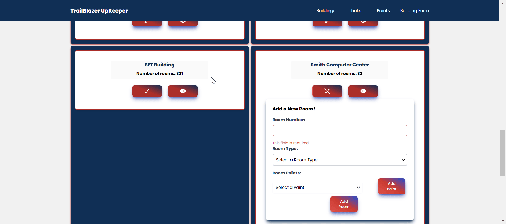
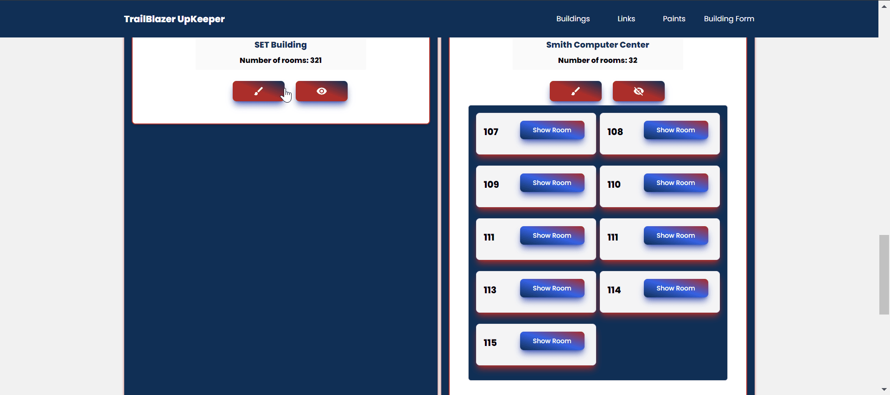
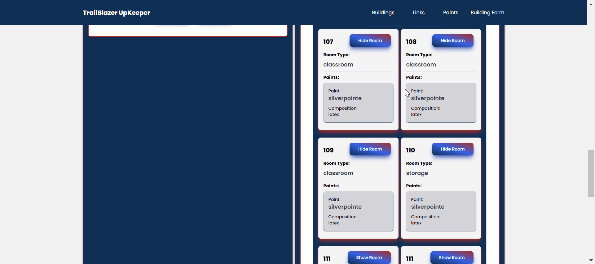
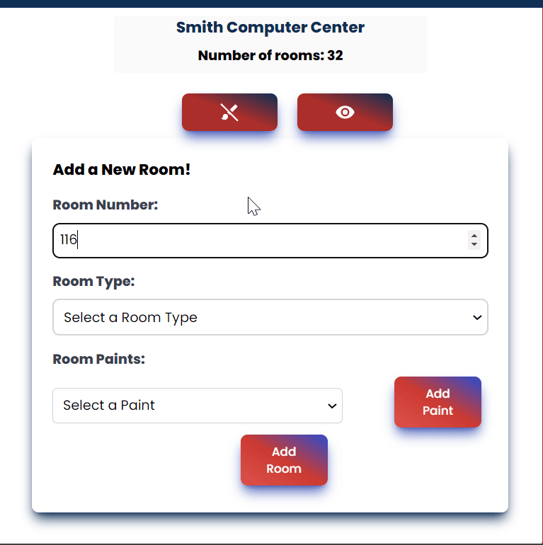
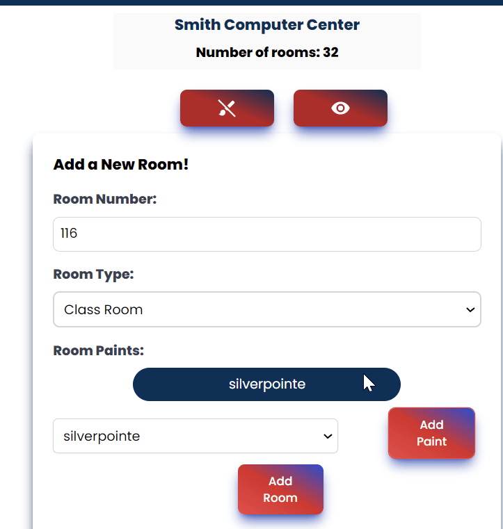
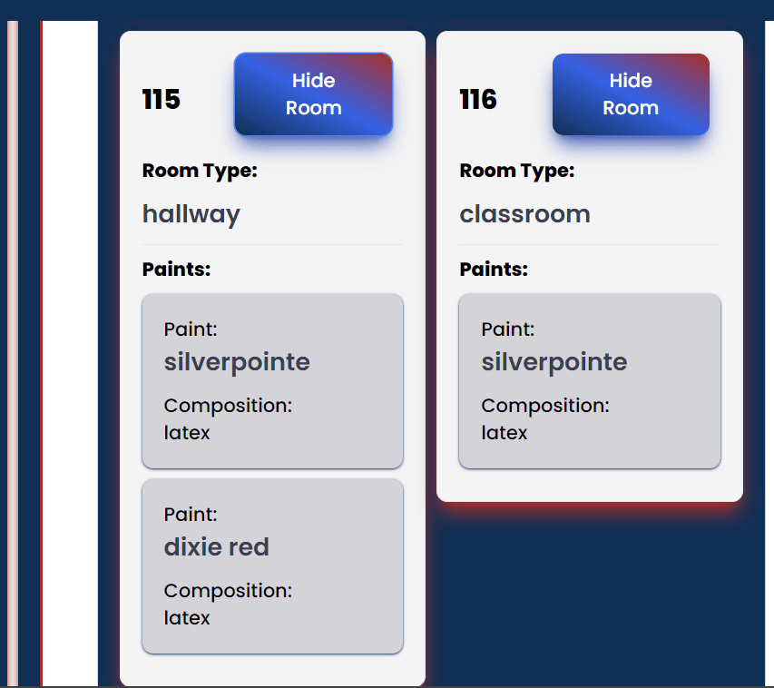

# Trailblazer Upkeeper

## Senior Project CS4600 Spring 2023 Semester

### By: Kendall Baker

This project is planned to help out Utah Tech University Building Maintenance workers specifically. The main reason i am making this project is because currently when Building Maintenance receives a work order for example like this
> Water leak in ceiling of room 217 in the Human Performance Center, water has damaged ceiling tiles and the wall, we will need to replace the ceiling tiles and repair the wall.

With this work order the building maintenance workers will need to know the specific paint color but also depending on where its at in the building it maybe different sheens of the same color and also a different chemical combination.

We experience this problem on a daily basis, so one way I have devised is to make a Web application to help keep track of the paint color, the paint sheen, type of ceiling tiles, and other maintenance materials for each room in each building on campus.

| Week | Dates        | Milestone         |
| ---- | ------------ | ----------------- |
| 1    | Jan 15-21    | Learn React       |
| 2    | Jan 22-28    | Learn React       |
| 3    | Jan 29-Feb 4 | Enviroment Setup  |
| 4    | Feb 5-11     | Authentication    |
| 5    | Feb 12-18    | Authentication    |
| 6    | Feb 19-25    | Data Collection   |
| 7    | Feb 26-Mar 4 | Rest Requests     |
| 8    | Mar 5-11     | Frontend          |
| 9    | Mar 12-18    | Rest Requests     |
| 10   | Mar 19-25    | Frontend          |
| 11   | Mar 26-Apr 1 | Extra Features    |
| 12   | Apr 2-8      | Deploy            |
| 13   | Apr 9-15     | Turn In           |
| 14   | Apr 16-22    | Showcase          |
| 15   | Apr 23-29    | Portfolio Defense |

  

    <figure>
      
      <figcaption>This is the Home page for TrailBlazerUpKeeper.</figcaption>
    </figure>
  

  

    <figure>
      
      <figcaption>The building page, from here the user can view every building and also view and add rooms.</figcaption>
    </figure>
  

  

    <figure>
      
      <figcaption>The user can select a building to add a room to, in this instance the form for adding a room to the Smith Computer Center is open.</figcaption>
    </figure>
  

  

    <figure>
      
      <figcaption>The user can also view current rooms in the building, in this instance the rooms of the Smith Computer Center are being shown.</figcaption>
    </figure>
  

  

    <figure>
      
      <figcaption>In this instance some of the Rooms are being shown and the paints in each room are visible.</figcaption>
    </figure>
  

  

    <figure>
      
      <figcaption>Lets add a room!</figcaption>
    </figure>
  

  

    <figure>
      
      <figcaption></figcaption>
    </figure>
  

  

    <figure>
      
      <figcaption>Here is the room we have just created.</figcaption>
    </figure>
  

